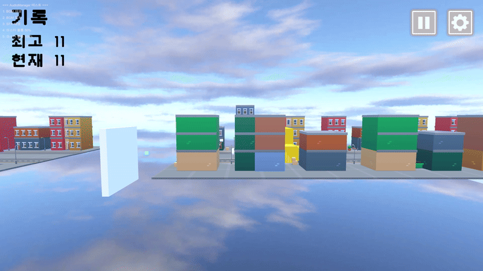
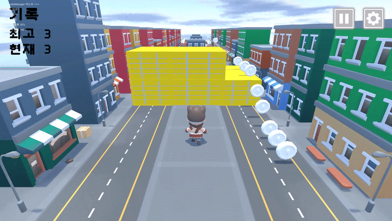
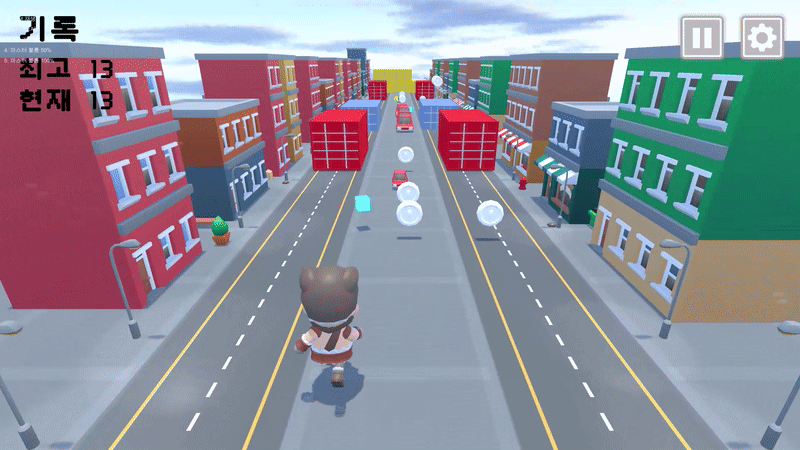
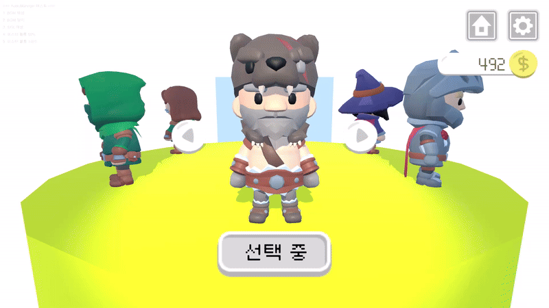
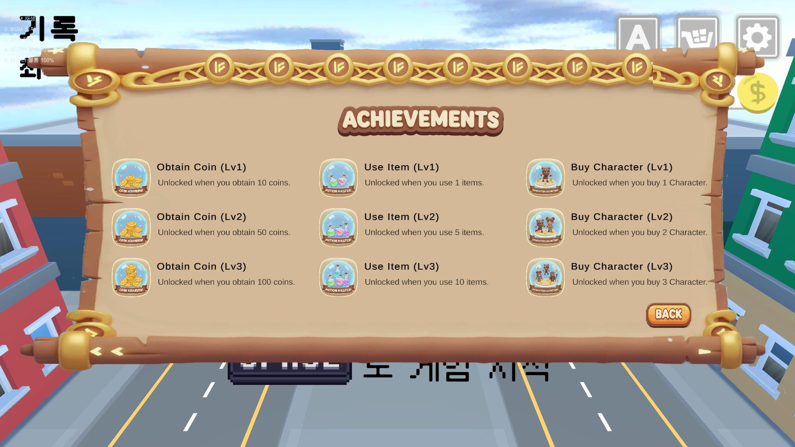
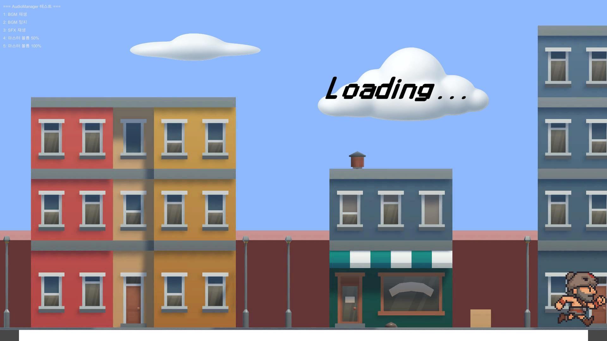

# 게임명: ThreadRun

## 📑 목차
1. [프로젝트 장르 및 소개](#프로젝트-장르-및-소개)
2. [주요기능](#주요기능)
3. [역할분담](#역할분담)
4. [구현내용](#구현내용)
5. [트러블슈팅](#트러블슈팅)
6. [기술스택](#기술스택)
7. [사용에셋 목록](#사용에셋-목록)

---

## 프로젝트 장르 및 소개

<table>
  <tr>
    <th align="left" width="180"> 항목 </th>
    <th align="left" width="500"> 내용 </th>
  </tr>
  <tr><td> 장르 </td><td> 횡스크롤 3D 러닝 액션 게임 </td></tr>
  <tr><td> 소개 </td><td> 좌우와 점프, 슬라이드 조작을 통해 장애물들을 피해 달리면서 돈을 먹어 점수를 올리는 게임 </td></tr>
  <tr><td> 개발 기간 </td><td> 총 7일 { 2025.11.14 ~ 2025.11.21 } </td></tr>
</table>

* [저장소 원본 링크](https://github.com/shin0112/ThreadKidRun)

---

## 주요기능
### 게임플레이
- 게임 시작 시에 튜토리얼을 통해 조작법을 설명 받으면서 게임이 진행.
- 좌우 이동과 점프, 슬라이드 기능을 통해 장애물을 회피하고 돈을 먹어 점수를 획득.
- 아이템의 종류는 무적과 스피드가 있으며 획득 시 일시적으로 종류에 맞는 버프가 발동.
- 획득한 돈으로 캐릭터 스킨을 구매할 수 있는 상점이 존재하며 스킨 적용이 가능.
- 획득한 돈, 사용된 아이템, 구매한 캐릭터 스킨의 개수에 따른 업적 해금 시스템이 존재.

### 핵심기술
- Managers
  * GameManager에서 코인, 점수, 데이터, 업적, 씬 등 주요 값 관리.
  * AchievementManager에서 업적 관리.
  * AudioManager에서 사운드(배경음, 효과음) 관리.
  * PowerUpManager에서 버프 관리.
  * UIManager에서 UI 관리.
- Map
  * MapMove에서 맵 이동 관리, 생성 파괴 관리.
  * PlayerCollider에서 장애물 충돌 처리.
  * Coin에서 충돌 시 점수 획득.
- Player
  * CustomizingController에서 커스터마이징 시 저장되어야 하는 정보 전달.
  * PlayerAnimation에서 플레이어 애니메이션 관리.
- PowerUp
  * PowerUpBase에서 파워업 아이템의 기본 클래스.
  * PowerUpItem에서 필드에 배치되는 파워업 아이템 관리.
  * InvincibilityPowerUp에서 무적 파워업 아이템 관리.
  * PowerUpSpawner에서 파워업 아이템 랜덤 스폰.
  * SpeedBoostPowerUp에서 스피드 부스트 파워업 아이템 관리.
- Shop
  * CharacterSlot에서 캐릭터 SkinData(SO) 관리
  * ShopController에서 상점 회전, 캐릭터 슬롯 관리
- StatHandler로 플레이어 캐릭터의 모든 능력치를 관리.
- ScriptableObject로 정의한 캐릭터, 적, 무기, 장비, 아이템, 페이즈, 스킬
- 각 효과의 사운드와 이미지, UI. 중복 재생을 막기 위한 쿨다운 기능. 
- ObjectPoolManager에서 사용할 프리팹을 미리 생성하고 관리.
- SO로 정의한 데이터를 이용한 적 자동 생성 기능.

---

### 6. UI

<table>
  <tr>
    <th align="left" width="200">코드 이름</th>
    <th align="left" width="500">역할</th>
  </tr>
  <tr><td>AchievementUI</td><td>업적 창</td></tr>
  <tr><td>ButtonUI</td><td>버튼 관리</td></tr>
  <tr><td>CoinUI</td><td>코인</td></tr>
  <tr><td>GameOverUI</td><td>게임오버 창</td></tr>
  <tr><td>PauseUI</td><td>일시정지 창</td></tr>
  <tr><td>ScoreUI</td><td>점수 창 (최고 점수, 현재 점수)</td></tr>
  <tr><td>SettingUI</td><td>환경 설정 (오디오 조정)</td></tr>
  <tr><td>ShopUI</td><td>상점 버튼</td></tr>
  <tr><td>Tutorial</td><td>튜토리얼 UI</td></tr>
</table>

### 7. Scriptable Objects

<table>
  <tr>
    <th align="left" width="200">코드 이름</th>
    <th align="left" width="500">역할</th>
  </tr>
  <tr><td>AchievementData</td><td>업적 데이터</td></tr>
  <tr><td>CharacterSkinData</td><td>캐릭터 스킨 데이터</td></tr>
  <tr><td>PowerUpData</td><td>파워업(버프) 데이터</td></tr>
  <tr><td>SoundData</td><td>사운드 데이터</td></tr>
</table>

### 8. Etc

<table>
  <tr>
    <th align="left" width="200">코드 이름</th>
    <th align="left" width="500">역할</th>
  </tr>
  <tr><td>Define</td><td>상수 관리</td></tr>
  <tr><td>Extensions</td><td>확장 메서드</td></tr>
  <tr><td>Logger</td><td>커스텀 로그</td></tr>
</table>

---

## [기능 설명]

### 1. 캐릭터

- 움직임
  - 이동 (AD)
  - 점프, 이단 점프 (Space)
  - 슬라이딩 (Control)
- 애니메이션 적용

### 2. 맵

- 배경 무한 생성
  - `LastPivot`, `DeadZone`을 통해 맵 무한 생성

- 장애물 충돌

- 코인 획득

### 3. 버프

- 버프 적용 (무적, 스피드 업)

### 4. 상점

- 캐릭터 선택, 구매
- 캐릭터 커스터마이징

### 5. 업적

- 업적 해금

### 6. 튜토리얼

- 튜툐리얼

### 7. 로딩 씬

### 8. 기타

- 설정
  - 음향 조절 가능

## [트러블슈팅]

> 개발 중 발생한 주요 이슈 및 해결 과정을 정리했습니다.  
> 각 항목은 별도 TIL 또는 블로그 포스트로 링크됩니다.

| 주제                   | 해결 요약                                      | 링크     |
| ---------------------- | ---------------------------------------------- | -------- |
| 파괴된 오브젝트에 접근 | 사용하기 전에 NULL 체크하고 캐싱하기           | [🔗 -]() |
| 태그 오류              | GameManager에서 타입으로 탐색 및 캐싱하여 사용 | [🔗 -]() |

---
